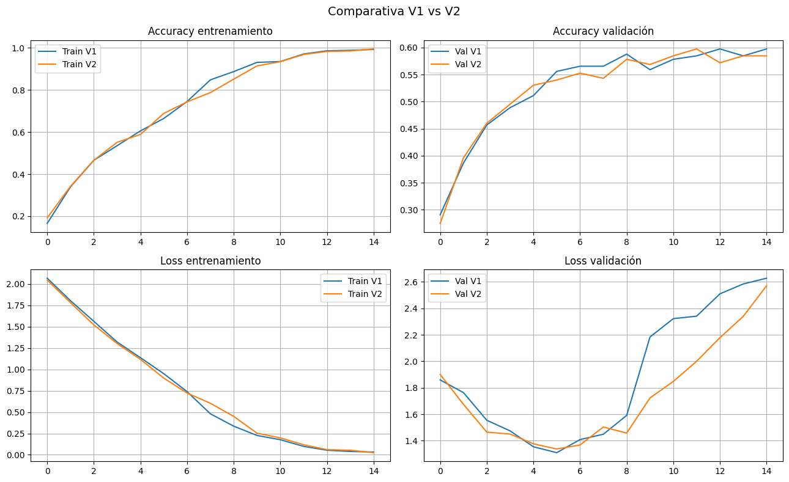

# Clasificador de imágenes de animales (CNN)

[English](README.md) · **Español**

Una red neuronal convolucional construida con Keras para clasificar imágenes en 8 categorías de animales: aves, carpinchos, elefantes, gatos, monos, suricatas, perros y sapos.

El resultado principal del proyecto no es la precisión en sí, sino el **diagnóstico**: por qué el modelo no logra generalizar y por qué hacerlo más chico no lo resolvió.

## Contenido

1. **Preparación de datos** — 1.567 imágenes divididas 80/20 (1.254 para entrenamiento, 313 para validación), redimensionadas a 200×200 px.
2. **Modelo V1** — cuatro bloques Conv2D + MaxPooling2D con filtros crecientes (32 → 64 → 128 → 128), ~2.6M de parámetros.
3. **Análisis de overfitting** — curvas de entrenamiento y validación a lo largo de 15 épocas.
4. **Prueba de predicción** — salida softmax sobre una imagen de Tom (de *Tom y Jerry*).
5. **Modelo V2** — 32 filtros constantes por bloque, ~619K parámetros (75% menos).
6. **Comparación** — ambas arquitecturas lado a lado.

## Resultados

| Modelo | Parámetros | Accuracy entrenamiento | Accuracy validación | Loss validación |
|---|---|---|---|---|
| V1 | ~2.6M | 0.992 | 0.597 | 2.63 |
| V2 | ~619K | 0.994 | 0.585 | 2.57 |

La prueba de predicción deja el problema a la vista: el gato animado fue clasificado como **ave con 70% de confianza** ("gato" obtuvo 0%).

**Conclusión:** ambos modelos memorizan el conjunto de entrenamiento (~99%) mientras la precisión de validación se estanca cerca del 59%, y la pérdida de validación sube a partir de la época 6 — un patrón clásico de overfitting. Reducir los parámetros un 75% no mejoró la generalización, lo que señala al **dataset** (tamaño y variedad) como el cuello de botella, y no a la arquitectura.

**Próximos pasos:** data augmentation y transfer learning desde un modelo preentrenado.

## Cómo correrlo

El notebook está pensado para **Google Colab**. El dataset está alojado en Google Drive — la sección 0 del notebook explica cómo agregarlo al propio Drive antes de ejecutarlo.

## Tecnologías

Python · TensorFlow · Keras · NumPy · Matplotlib
